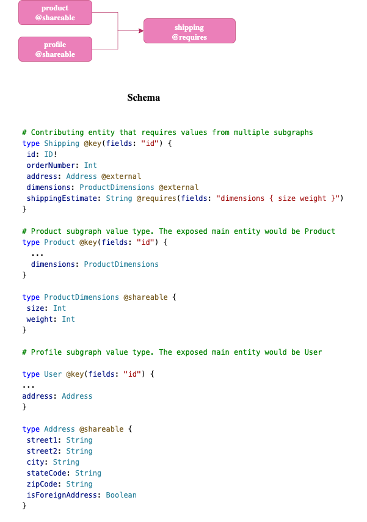

# Store

## Dev Set up

```
# install subgraphs & gateway deps
cd subgraphs/products && npm i 
cd subgraphs/customer && npm i 
cd subgraphs/shipping && npm i
cd gateway && npm i 

# start the subgraphs
npm run start:dev

# 🚀 Subgraph customer running at http://localhost:5010/
# 🚀 Subgraph products running at http://localhost:5020/
# 🚀 Subgraph shipping running at http://localhost:5030/

# exportAPOLLO_KEY=service:SECRET
# start the gateway
npm run start:gw
# 🚀 Gateway ready at http://localhost:4000/
```



## Desired State

```
# shipping subgraph
query {
  shippingReference {
    id
    orderNumber
    shippingEstimate # query planner calls customer & products
  }
}
```

Sample schema definition, utilizing [@requires](https://www.apollographql.com/docs/federation/entities-advanced#using-requires-with-object-subfields).

## Example of @provides

We can use @provides on an field resolved by another subgraph, to override their value. In this example, we have the field **Product.description**. While "description" can be resolved in the _Product_ subgraph, the _Shipping_ subgraph has its own value for it, and wants to return it for queries calling this service.

Observe the query 
```
query InStockCount{
  inStockCount(shippingId: "1") {
    quantity
    product {
      id
      description
    }
  }
}
// response
{
  "data": {
    "inStockCount": {
      "quantity": 100,
      "product": {
        "id": "1",
        "description": "Duis aute irure dolor in reprehenderit in voluptate velit esse cillum."
      }
    }
  }
}
```

This yields the query plan below. It instructs the gateway that for this query, it doesn't need to invoke the _Product_ subgraph because the field is resolved here.

```
QueryPlan {
  Fetch(service: "shipping") {
    {
      inStockCount(shippingId: $shippingId) {
        quantity
        product {
          id
          description
        }
      }
    }
  },
}
```

Now the _Shipping_ subgraph doesn't return the **Product.name** for which the gateway then needs to call the _Product_ subgraph

```
query InStockCount {
  inStockCount(shippingId: "1") {
    quantity
    product {
      id
      name
      description
    }
  }
}
//response
{
  "data": {
    "inStockCount": {
      "quantity": 100,
      "product": {
        "id": "1",
        "name": "Pants",
        "description": "Duis aute irure dolor in reprehenderit in voluptate velit esse cillum."
      }
    }
  }
}
```

Execution plan:
````
QueryPlan {
  Sequence {
    Fetch(service: "shipping") {
      {
        inStockCount(shippingId: $shippingId) {
          product {
            __typename
            id
            description
          }
          quantity
        }
      }
    },
    Flatten(path: "inStockCount.product") {
      Fetch(service: "products") {
        {
          ... on Product {
            __typename
            id
          }
        } =>
        {
          ... on Product {
            name
          }
        }
      },
    },
  },
}
```
